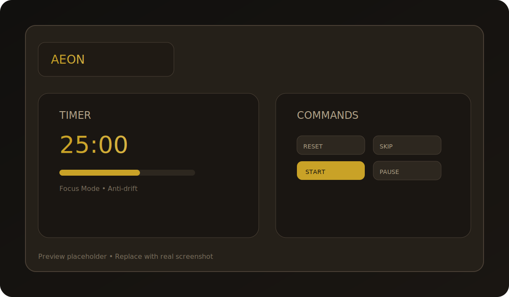
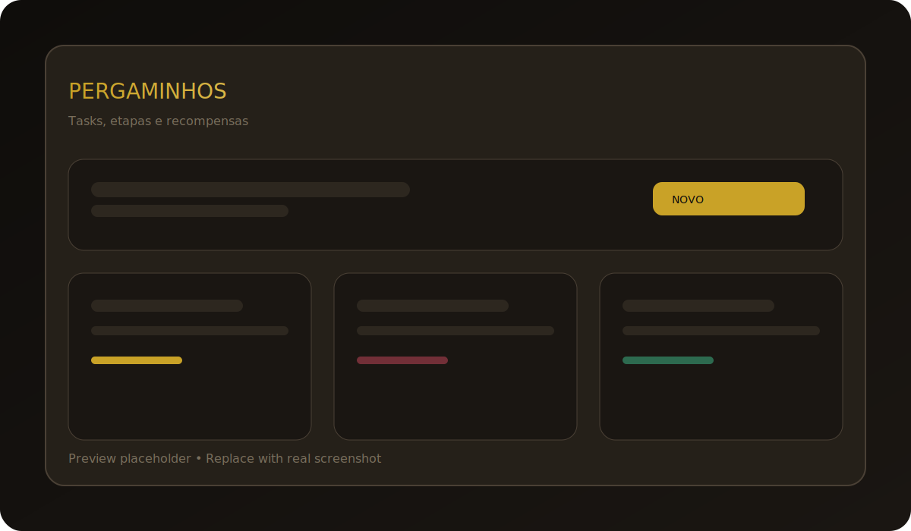

# Aeon ⏳

Idiomas: 🇧🇷 PT-BR (principal) | 🇺🇸 [English](README.en.md)

[](LICENSE)
[](https://github.com/pedronalis/aeon/commits/main)
[](https://github.com/pedronalis/aeon)

> _Domine seu tempo, forje sua eternidade_

Aeon é um aplicativo desktop de Pomodoro com foco em precisão, gamificação e um tema medieval premium. Roda offline, guarda seus dados localmente e oferece modos de foco personalizáveis.

## 🪟 Instalação no Windows (passo a passo)

1. Instale Node.js 20+ e Git.
2. Instale Rust (MSVC) via rustup e abra um novo terminal:

```bash
winget install Rustlang.Rustup
rustup default stable-x86_64-pc-windows-msvc
```

3. Instale **Visual Studio Build Tools** com o workload **Desktop development with C++** (MSVC + Windows 10/11 SDK).
4. Instale o **WebView2 Runtime (Evergreen)**.
5. Clone o repo e instale dependencias:

```bash
git clone https://github.com/pedronalis/aeon.git
cd aeon
npm install
```

6. Rodar em desenvolvimento:

```bash
npm run tauri:dev
```

7. Gerar instalador (NSIS):

```bash
npm run tauri:build:windows
```

8. Instalador gerado em `src-tauri/target/release/bundle/nsis/`.
9. Opcional (MSI): instale o **WiX Toolset** e rode:

```bash
npm run tauri:build -- --bundles msi
```

## 🖼️ Screenshots

| Timer | Pergaminhos |
| --- | --- |
|  |  |

> As imagens são placeholders. Substitua pelos screenshots reais quando quiser.

## ✨ Destaques

- ⏱️ **Timer anti-drift** baseado em timestamps reais
- 🎨 **Modos preset + custom** (Tradicional, Foco Sustentável, Animedoro, Mangadoro)
- 🏆 **Gamificação completa**: XP dinâmico, níveis, streaks e 20 conquistas
- 🧾 **Pergaminhos (tarefas)** com etapas, prazos e recompensas
- 🎯 **Missões diárias e semanais** com bônus de XP
- 📊 **Estatísticas detalhadas** + export CSV
- 🔔 **Notificações nativas** e atalhos de teclado
- 💾 **SQLite com migrations** (dados locais)

## 🚀 Stack

- Frontend: React 19 + TypeScript + Vite + Zustand + TailwindCSS
- Backend: Tauri 2 + Rust
- Persistência: SQLite (tauri-plugin-sql)
- Testes: Vitest + Testing Library

## 📦 Requisitos

- Node.js 20+
- Rust 1.75+ (https://rustup.rs)
- Linux: `webkit2gtk`, `libappindicator`, `librsvg2`
- Windows: Visual Studio Build Tools (Desktop C++), WebView2 Runtime

## 🛠️ Desenvolvimento

```bash
# Instalar dependências
npm install

# Carregar ambiente Rust (primeira vez)
source $HOME/.cargo/env

# Rodar em dev (auto-detecta GPU/sessão e aplica defaults seguros)
npm run tauri:dev

# Rodar testes
npm test
```

**O comando `tauri:dev` inicia automaticamente:**
- Frontend Vite dev server em `http://localhost:1420/`
- Backend Rust com hot reload
- Database SQLite local

### Wayland + NVIDIA

Por padrão o DMABUF fica desabilitado para evitar crash do WebKitGTK. Para testar:

```bash
AEON_WAYLAND_DMABUF=1 npm run tauri:dev
```

### Modo de Performance

Em ambientes lentos, ative **Modo de Performance** nas configurações. Ele reduz animações e sombras pesadas. Para forçar no dev:

```bash
VITE_AEON_LOW_FX=1 npm run tauri:dev
```

### Diagnóstico de ambiente

```bash
./scripts/detect-env.sh
```

### Scripts úteis

```bash
npm run tauri:dev:wayland
npm run tauri:dev:wayland-nvidia
npm run tauri:dev:wayland-intel
npm run tauri:dev:x11
npm run tauri:dev:software
npm run tauri:build
```

## 💾 Banco de dados

- Linux: `~/.local/share/com.pedro.aeon/pomodore.db`
- Migrations: `src-tauri/src/db.rs`

## 📚 Documentação

- `docs/QUEST_SYSTEM.md`

## 🧪 Testes

```bash
npm test
npm run test:watch
npm run test:ui
npm run test:coverage
```

## 📦 Build

```bash
npm run tauri:build
```

Instaladores em `src-tauri/target/release/bundle/`.

## 🗂️ Estrutura do repo

- `src/` UI + estado + domínio
- `src-tauri/` backend Rust + migrations
- `scripts/` utilitários (detect-env, launcher dev)

## 🤝 Contribuindo

Leia `CONTRIBUTING.md` para setup, padrões e fluxo de trabalho.

## 📄 Licença

MIT - veja `LICENSE`.
